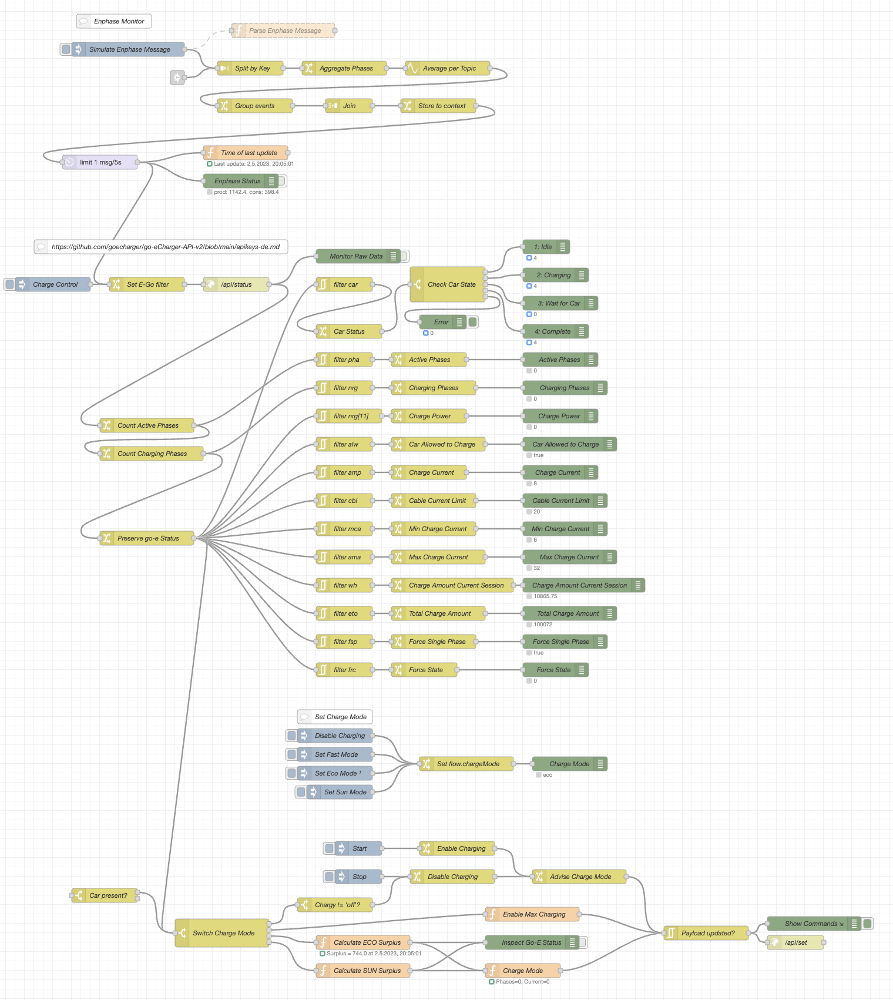

# IoT
A set of tools created for my home automation

# Enphase Monitor for Node-Red
Import file [enphase]
## Features

* Endpoint /stream/meter
  * continuous surveillance of solar power, consumption and net consumption
  * automatic generation of correct timestamp per event, down to the second
  * each event provides per phase
    * current power
    * react power
    * apparent power
    * rms voltage
    * rms current
    * power factor
    * frequency
  * store each event to influxdb2
* Endpoint /api/v1/production/inverters
  * Continuous poll (5m) of solar power per inverter
    * current power
    * maximum power
    * inverter serial number
  * store each event to influxdb2

# Go-eCharger Controller for Node-Red
Import file [go-eCharger]
## Features
* Four charging modes:
  * off: disable charging
  * fast: maximum charge power, no controlling
  * eco: charge what is left from solar system (besides other consumers)
  * sun: charge all solar energy
* Continuous poll (1m) of Go-eCharger state
* Continuous refresh of solar and consumption power from Enphase

[enphase]: Enphase_NodeRed_Monitor.json
[go-eCharger]: go-eCharger_NodeRed_Controller.json